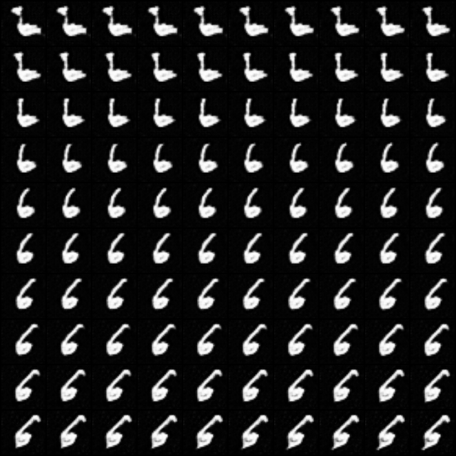
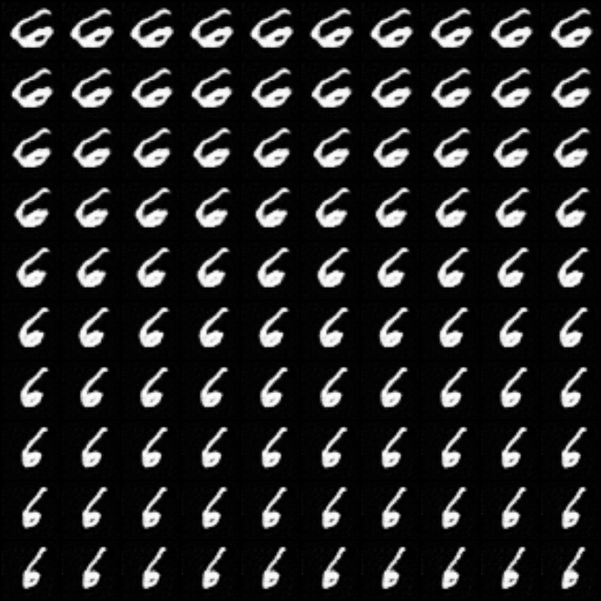
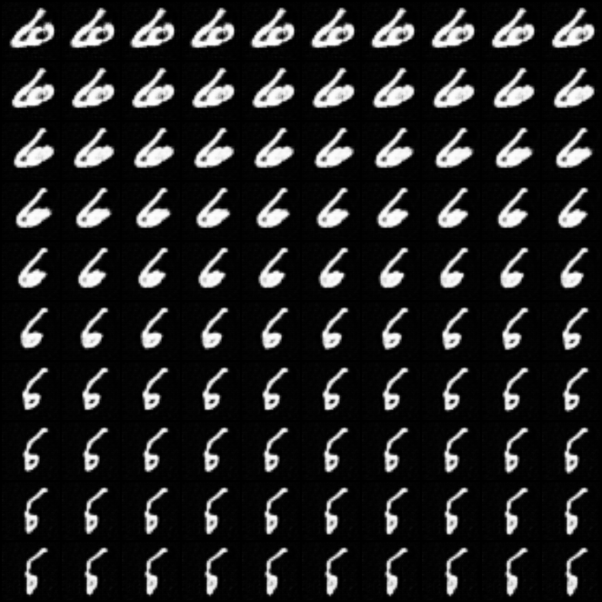
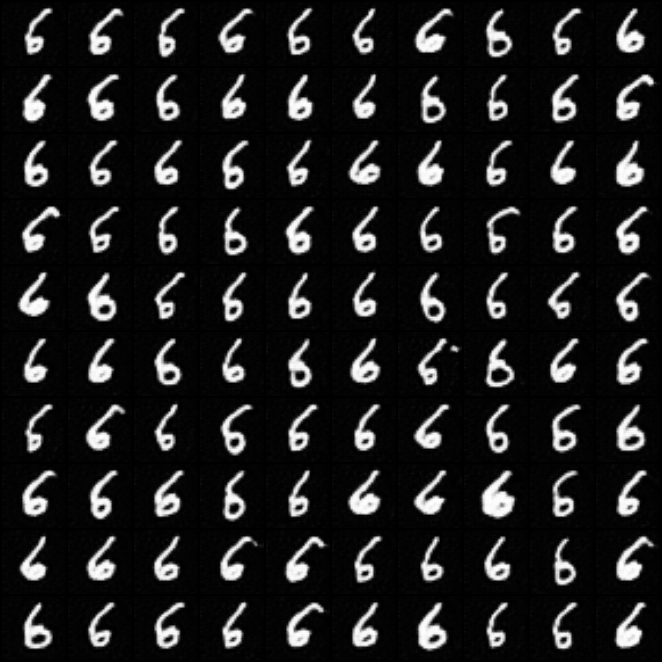

# Implementation of InfoGAN with pytorch

Implementation of [Infogan: Interpretable representation learning by information maximizing generative adversarial nets.](http://papers.nips.cc/paper/6399-infogan-interpretable-representation) with pytorch.

## Usage

### train

```sh
python infoGAN.py --help # for help
python infoGAN.py
```

Training results are under `tmp/save_<time>/`.

For other datasets:

+ put it under `data/`  
+ write `get_data` function in `data.py`
+ register it in `opt.py` and `data.py`

### traverse

```sh
python info_util.py --help # for help
python info_util.py --model-path </path/to/netG.pt> --cidx <targeted-continuous-idx> --didx <targeted-discrete-idx>
```

### evaluation with FID

```sh
python -m utils.eval --help # for help
```

check `bin/eval.sh` as an example.

## Results on MNIST

train options:

```sh
python infoGAN.py --epochs 50 --batch-size 128
```

Traverse results on three continuous variables (fixing other variables) and
one discrete variables ( fixing the discrete variable and randomly choose other variables ).

| 1st continuous factor (*Controling the slope of digits*) | 2nd continuous factor (*Controlling the width of digits*) |
| -- | -- |
| |  |
| **3rd continuous factor (*Controlling the stroke thickness of digits*)** | **1st discrete factor (*Almostly preserving the class of digits*)**  |
|  |  |

## Plans

+ [x] Evaluation with FID.
+ [ ] More training results on other datasets.
+ [ ] Adaptive module to apply infoGAN on other GAN models: like Info-ProGAN. Check the `info_util.py` for loss and noise generator used in InfoGAN.

## Conclusions

+ The results are selected, so the complete results might not as perfect as desired, but infoGAN does present ability to controll the semantic of output.
+ InfoGAN cannot achieve perfectly disentangled controll on output, it was not designed to do this. From results on MNIST above, the 3rd continuous factor seems to entangle with the slope of digits.

## References

[1] Chen, Xi, et al. "Infogan: Interpretable representation learning by information maximizing generative adversarial nets." Advances in neural information processing systems. 2016.  
[2] [https://github.com/Natsu6767/InfoGAN-PyTorch](https://github.com/Natsu6767/InfoGAN-PyTorch)